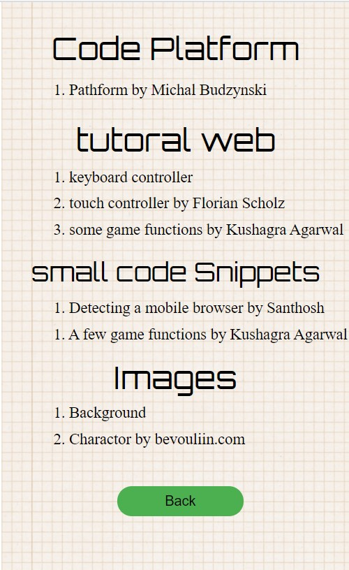

# Chicky Jump Game
Chicky Jump Game is a PWA JavaScript Canvas game that supports PC, IOS and Android platforms developed from an online open-source code. It means to challenge players to jump up through a series of platforms and beat the highest score. 

Doodle Jump is one of my favorite games when I was in grade 10. This inspired me to make a Doodle Jump game in my version when I started learning to code.  

Check out this link: [https://chicky-jump.herokuapp.com/](https://chicky-jump.herokuapp.com/)

## How does Chicky Jump game work?
1. Make the game environments suitable for a device that players are using
2. Tap Play NOW! on HomePage to call a gameLoop to draw a character and generate platforms
3. Control horizontal movements of character by arrow/blue buttons
4. Increase the vertical velocity to the character if it is not on the air (it touches the ground)
5. Apply gravity to the character
6. Repeat the gameLoop to update character's and platforms' positions every 30 milliseconds
7. Increase a score as the character steps on a platform and goes up
8. Randomly generate platforms with different types of effects over time
9. Draw the character on a different side when it goes off the left/right screen 
10. Draw a GameOver page, reset and show the score when the character goes off the bottom screen

## Key skills
1. JavaScript
2. HTML/CSS
3. JS Canvas
4. JS OOP
5. PWA

## What is next for Chicky Jump Game?
This is the latest version of the Chicky Jump game. However, some features can be added.
1. Add obstacles
2. Add more characters that players can select
3. Add more types of platforms
4. Add more graphic to the character

## Example of HomePage, GameModePC, GameModeIOS, GameOver and Credit

### Home Page

### Game Mode on PC

### Game Mode on IOS

### Game Over

### Credit

  